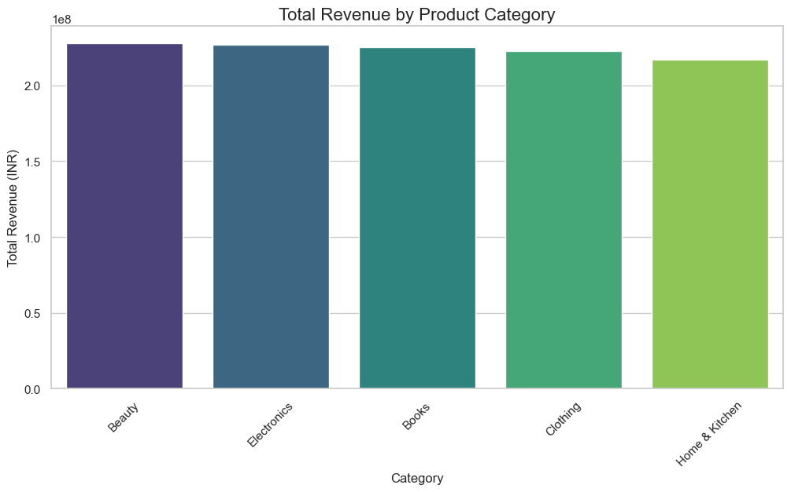
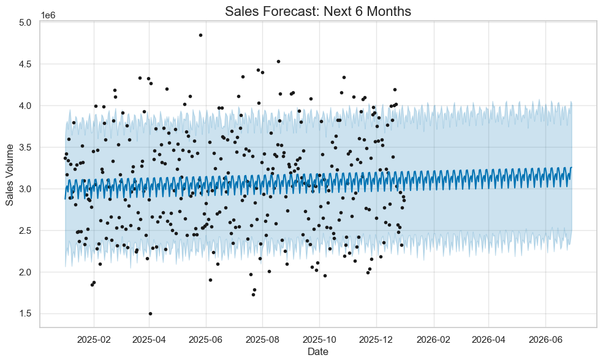

# Amazon Sales Analysis 2025: Revenue Optimization & Forecasting

## Executive Summary
This project analyzes **15,000+ sales transactions** from Amazon India (2025) to solve critical business problems: identifying revenue drivers, mitigating high return rates, and forecasting future demand. 
Using **Python** for advanced analytics/forecasting and **SQL** for business querying, the analysis uncovered a **32% return rate** in key categories and identified specific high-value customer segments for targeted retention.

* 📓 [Analysis Notebook (EDA + Prophet)](amazon_sales.ipynb)
* 📜 [SQL Queries File](Amazon%20Sales.sql)
* 📂 [Cleaned Dataset](cleaned_amazon_sales_2025.csv)

## Key Business Insights

### 1. Revenue & Product Performance
* **Top Performers:** `Beauty` and `Electronics` are the leading categories, generating **~₹227 Million** each.
* **Underperformer:** `Home & Kitchen` lags behind in total revenue contribution.
* **Pricing Strategy:** High-ticket items (Price > ₹20k) are driving the bulk of revenue, despite lower transaction volumes.

### 2. Operational Risk: Return Rates
* **Critical Finding:** The dataset reveals a **32% Return Rate** across all orders.
* **High-Risk Categories:** `Books` and `Electronics` show the highest probability of returns.
* **Impact:** This represents a potential revenue leakage of over **₹350 Million** if unaddressed.

### 3. Forecasting (Q1 2026 Outlook)
* **Trend:** The **Prophet** model predicts steady daily sales growth for the next 180 days.
* **Seasonality:** Weekly trends show a distinct spike in sales on **Mondays**, suggesting a "start-of-week" purchase behavior.

## Strategic Recommendations
*Based on the data, the following business actions are recommended:*

1.  **Reduce Returns in Electronics:** Initiate a "Pre-Purchase QA" check for Electronics vendors, as the 32% return rate is severely eroding margins.
2.  **Target "Whale" Customers:** SQL analysis identified customers spending **> ₹100,000**. These users should be moved to a "Prime Platinum" loyalty tier to ensure retention.
3.  **Monday Marketing Blitz:** Since sales peak on Mondays, shift 40% of the weekly ad budget to Sunday evenings/Monday mornings to maximize conversion.
4.  **Incentivize Prepaid Orders:** `Credit Card` users have a higher Average Order Value (AOV). Offer a 5% discount on prepaid orders to reduce cash-handling costs associated with COD.

## Visualizations

### 1. Revenue Drivers by Category

*Insight: Balanced revenue distribution, but Beauty/Electronics lead the pack.*

### 2. Daily Sales Trend & Volatility

*Insight: High daily volatility but a consistent annual baseline.*

### 3. Future Forecast (180 Days)

*Insight: Prophet predicts a stable upward trajectory for Q1 2026.*

## SQL Analysis
The project includes a dedicated SQL script (`Amazon Sales.sql`) that answers 8 key business questions:

1.  **Total Revenue:** Calculated the exact bottom-line revenue.
2.  **Top 5 Products:** Ranked categories by total sales volume.
3.  **Delivery Status:** Quantified the exact count of Delivered vs. Returned orders.
4.  **AOV by Payment:** Determined which payment method yields the highest order value.
5.  **Top States:** Identified top 5 regions (e.g., Sikkim, Rajasthan) for logistics planning.
6.  **Return Rate %:** Complex query to calculate return percentage per category.
7.  **Whale Customers:** Extracted IDs of customers who spent > ₹100,000.
8.  **Quality Control:** Identified products with an average rating < 3 stars.

## Technical Implementation

### Tech Stack
* **Python:** Pandas (Cleaning), Matplotlib/Seaborn (Visualization)
* **Machine Learning:** Facebook Prophet (Time Series Forecasting)
* **Database:** MySQL (Structured Querying)
